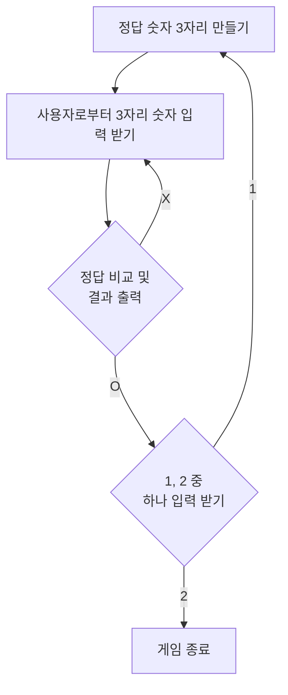
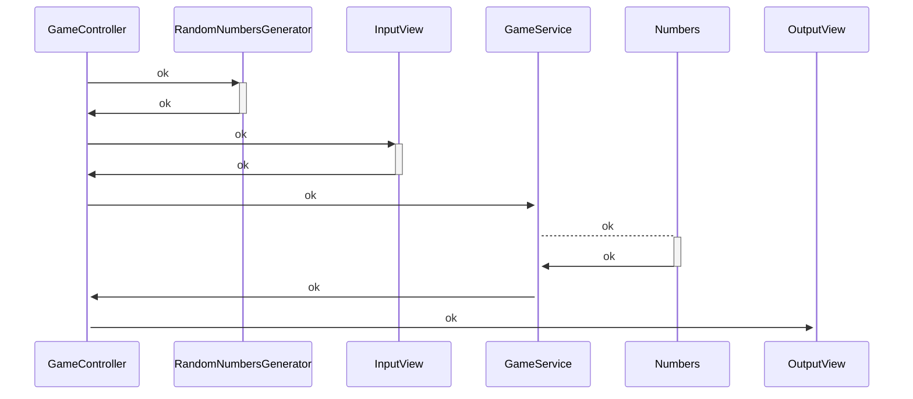

```mermaid
flowchart
    A[정답 숫자 3자리 만들기]
    B[사용자로부터 3자리 숫자 입력 받기]
    C{정답 비교 및\n결과 출력}
    D{1, 2 중\n하나 입력 받기}
    E[게임 종료]
    A --> B
    B --> C
    C -->|X| B
    C -->|O| D
    D -->|1| A
    D -->|2| E
```

```mermaid
sequenceDiagram
    GameController ->>+ RandomNumbersGenerator: ok
    RandomNumbersGenerator ->>- GameController: ok
    GameController ->>+ InputView: ok
    InputView ->>- GameController: ok
    GameController ->>+ GameService: ok
    GameService -->+ Numbers: ok
    Numbers ->>- GameService: ok
    GameService ->>+ GameController: ok
    GameController ->>+ OutputView: ok
```